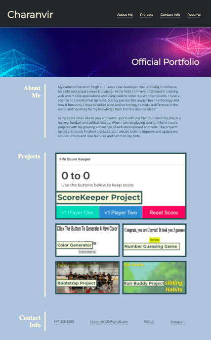

# Official-Portfolio

## Official Portfolio showcasing projects that I have completed and contact information for reaching me.

The About Me Section gives a small background about myself and my current hobbies and goals with development/coding.

The main project highlighted in my portfolio is a ScoreKeeper Application. It was designed to keep track of score in FIFA games, but will eventually include options to customize the layout. It utilizes HTML, CSS and JavaScript skills and knowledge. 

The other projects included in this portfolio include a Color Generator, a number guessing game, a bootstrap project and a Run Buddy landing page, which was worked on during class. 

Contact information is linked at the bottom of the portfolio. 

This repository includes the HTML page (called index.html), which is the content of the Portfolio. It also includes the CSS stylesheet and images that are used on his webpage, all which can be found in the assets folder. The commit history can be found, with detailed explanations of the changes that we're made during each commit. 

The following is a live link to my Official Portfolio: https://charanvir.github.io/Official-Portfolio/

The following are Github repositories links for the projects included in this Portfolio
- ScoreKeeper Project: https://github.com/Charanvir/ScoreKeeper-Project
- Color Generator Project: https://github.com/Charanvir/Color_Generator
- Number Guessing Game: https://github.com/Charanvir/Number-Guessing-Game
- Bootstrap Project: https://github.com/Charanvir/Bootstrap-Project
- Run Buddy Project: https://github.com/Charanvir/run-buddy

Below is a screenshot of my Portfolio:

